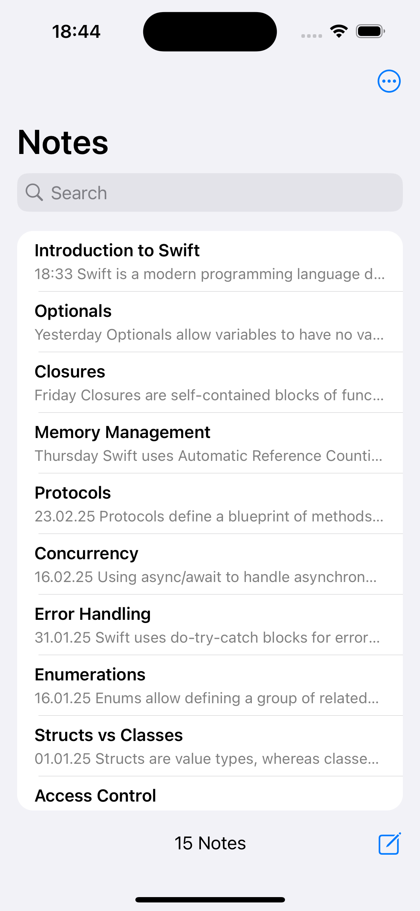
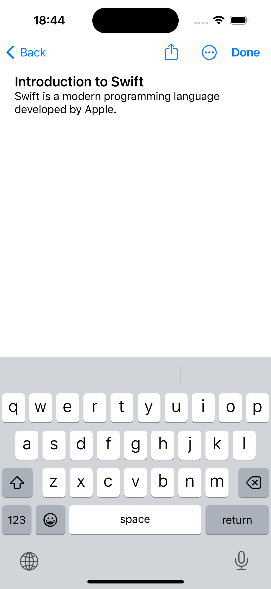
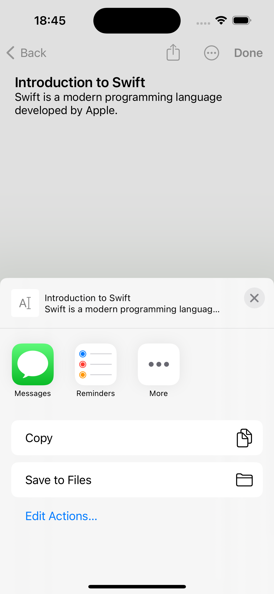
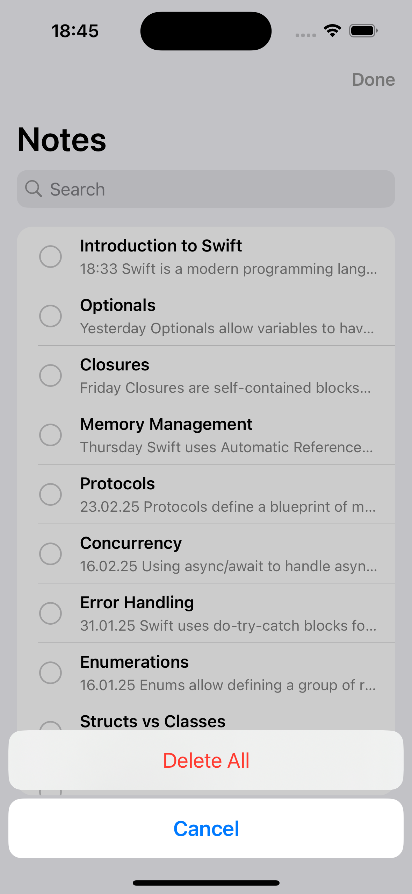
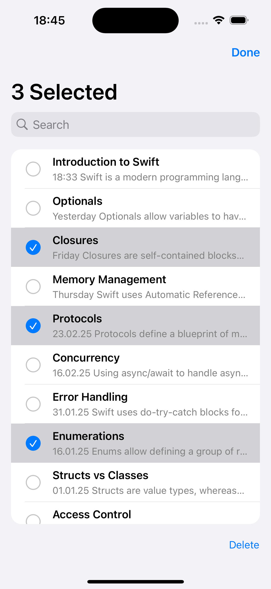
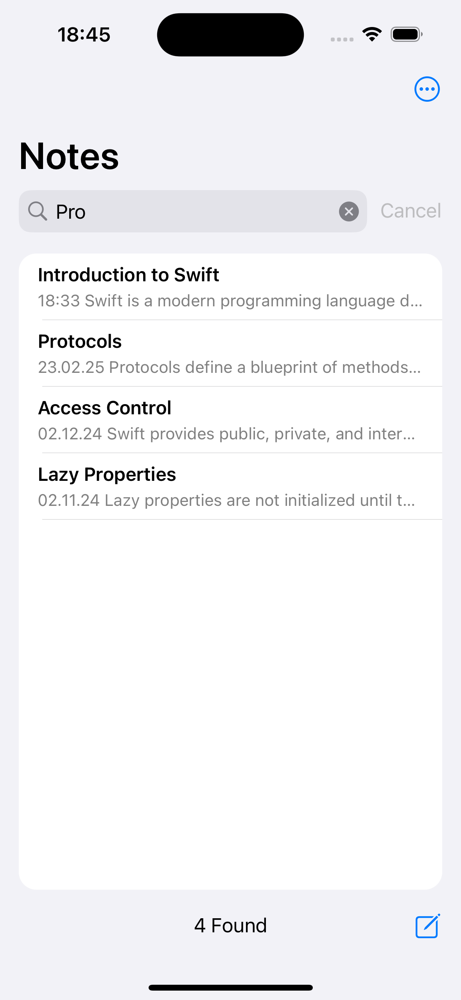
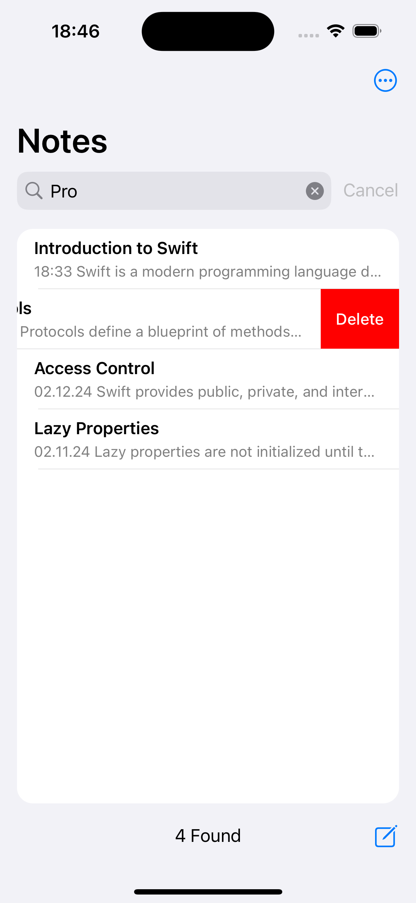
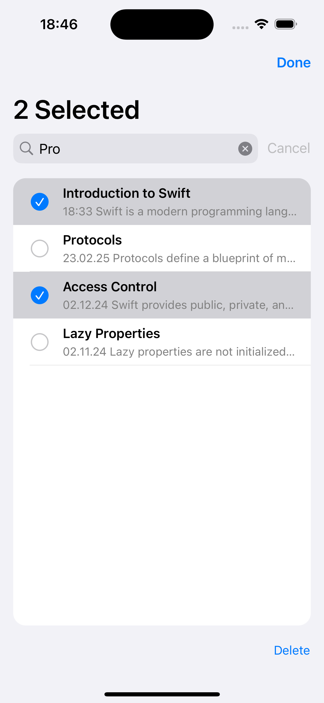
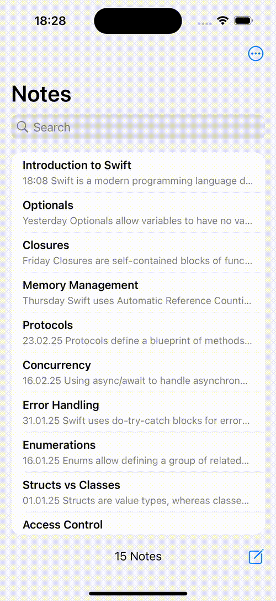

# NotesApp  
NotesApp is a simple note manager that allows users to create, edit, and delete notes.  

There are **7 different implementations**, each using different technologies to achieve the same functionality. These implementations were created to explore various development approaches.  

## Stack  
- **iOS Version:** 17.2+  
- **Technologies:** Swift, UIKit, Auto Layout, UITableView, UINavigationController  
- **UI:** Fully implemented in code (programmatic UI)  
- **Architecture:** MVC  

## Features  
- The application functions like a standard notes app.  
- Notes in the list are displayed based on the last modified date. The date is shown in different formats: time for today, "Yesterday" for the previous day, the day of the week for the current week, and dd.MM.yy for older notes. The total number of notes is displayed at the bottom.  
- When creating a new note, the keyboard opens automatically, the cursor is placed at the beginning, and the first line is bold. The first line is also used as the note's title in the list.  
- When editing a note, pressing the Done button hides the keyboard. Users can share the note or delete it using a button.  
- A note is saved when navigating back. If a note contained text but was completely cleared during editing, it is deleted. When a note is modified, its last modified date is updated in the list.  
- Notes can be deleted with a swipe. The Select Notes button allows users to choose multiple notes for deletion. If no notes are selected, there is an option to delete all. After selecting notes, the number of selected notes is displayed at the top.  
- There is a search mode with a cancel button. In search mode, users can select and delete notes from the search results. Editing is also available, and swipe-to-delete works within search mode. If a note is edited and its text no longer matches the search query, it disappears from the results. The total number of matching notes is displayed at the bottom.  
- After editing, notes are passed through a delegate, which notifies whether a note was updated or deleted.  
- The cell identifier is implemented as a universal extension.

## Screenshots  

<table align="center">
  <tr>
    <td></td>
    <td></td>
    <td></td>
  </tr>
  <tr>
    <td></td>
    <td></td>
    <td></td>
  </tr>
    <tr>
    <td></td>
    <td></td>
    <td></td>
  </tr>
</table>  

## Implementations  

### Version: NotesApp1  
[Link to folder](https://github.com/evgenff1/NotesApp/tree/main/NotesApp1)

- **Technologies Specific to This Version:** UITableViewDataSource  

## Features (Specific Advantages)  

- Classic approach: `UITableViewDataSource` provides full control over data presentation and updates.  
- Manual data management: Greater flexibility in handling complex data structures and relationships.  
- Performance optimization: Developers can fine-tune memory usage and data fetching strategies.  
- Explicit row updates: Fine-grained control over inserting, deleting, and reloading rows or sections.  
- Compatibility: Works with older iOS versions and various data sources without additional constraints.  

---

### Version: NotesApp2  
[Link to folder](https://github.com/evgenff1/NotesApp/tree/main/NotesApp2)

- **Technologies Specific to This Version:** Core Data, UITableViewDataSource  

## Features (Specific Advantages)  

- Inherits all UITableViewDataSource-related features from NoteApp1.
- Core Data integration: A built-in Apple framework for data persistence, optimized for performance and memory management.  
- Efficient data fetching: Reduces memory usage with lazy loading, fetching only necessary data.  
- Optimized storage: Uses SQLite under the hood, enabling structured data management.  
- Advanced querying: Easily filter and sort data using `NSFetchRequest`.  
- Automatic state tracking: Ensures data consistency and simplifies persistence.  

---

### Version: NotesApp3  
[Link to folder](https://github.com/evgenff1/NotesApp/tree/main/NotesApp3) 

- **Technologies Specific to This Version:** Core Data, NSFetchedResultsController, UITableViewDataSource  

## Features (Specific Advantages)  

- Inherits all Core Data and UITableViewDataSource-related features from NoteApp2. 
- Automatic UI synchronization: `NSFetchedResultsController` tracks Core Data changes and updates `UITableView` automatically.  
- Optimized memory usage: Loads only necessary objects, improving performance with large datasets.  
- Incremental updates: Modifies only affected rows instead of reloading the entire table, ensuring smooth animations.  
- Built-in sorting and filtering: Uses `NSSortDescriptor` and `NSPredicate` for efficient data organization.  
- Seamless Core Data integration: Eliminates the need for manual data tracking and ensures consistency across the app.  

---

### Version: NotesApp4  
[Link to folder](https://github.com/evgenff1/NotesApp/tree/main/NotesApp4)

- **Technologies Specific to This Version:** Core Data, UITableViewDiffableDataSource, NSDiffableDataSourceSnapshot  

## Features (Specific Advantages)  

- Inherits all Core Data-related features from NoteApp2. 
- Automatic UI updates: `UITableViewDiffableDataSource` eliminates the need for manual index path calculations.  
- Data consistency: Uses unique identifiers (`Hashable`) instead of `IndexPath`, preventing UI errors.  
- Better performance: Efficiently computes differences between snapshots and applies animations smoothly.  
- Simplified dynamic data handling: Ideal for filtering, searching, and live updates.  

---

### Version: NotesApp5  
[Link to folder](https://github.com/evgenff1/NotesApp/tree/main/NotesApp5)

- **Technologies Specific to This Version:** Core Data, UITableViewDiffableDataSource, NSDiffableDataSourceSnapshot, NSFetchedResultsController  

## Features (Specific Advantages)  

- Inherits all NSFetchedResultsController-related features from NoteApp3.  
- Inherits all UITableViewDiffableDataSource-related features from NoteApp4. 
- Combining `NSFetchedResultsController` and `UITableViewDiffableDataSource`:  
  - Fetches data efficiently from Core Data.  
  - Converts fetched results into snapshots for seamless UI updates.  
  - Ensures smooth animations and incremental updates while maintaining data consistency.  
  - Optimized for real-time data changes with minimal performance overhead.  
  
---
  
### Version: NotesApp6  
[Link to folder](https://github.com/evgenff1/NotesApp/tree/main/NotesApp6) 

- **Technologies Specific to This Version:** Realm (installed via Swift Package Manager), UITableViewDataSource 

## Features (Specific Advantages)  

- Inherits all UITableViewDataSource-related features from NoteApp1. 
- Realm integration: A high-performance, mobile-first database designed for efficiency and ease of use.  
- Live data updates: UI automatically reflects changes using `NotificationToken`.  
- Optimized performance: Faster read/write operations compared to Core Data and SQLite.  
- Memory-efficient lazy loading: Loads only required data, improving app responsiveness.  
- Object-oriented storage: Uses native Swift objects instead of relational tables.  
- Simplified CRUD operations: Adding, updating, and deleting notes requires minimal code.  
- Seamless multi-threading: Thread-safe architecture prevents data corruption. 

---

### Version: NotesApp7  
[Link to folder](https://github.com/evgenff1/NotesApp/tree/main/NotesApp7) 

- **Technologies Specific to This Version:** Realm (installed via Swift Package Manager), UITableViewDiffableDataSource, NSDiffableDataSourceSnapshot   

## Features (Specific Advantages)  

- Inherits all Realm-related features from NoteApp6.  
- Centralized constants management: All constants are now stored in a dedicated file, improving maintainability and reducing duplication.
- `NotificationToken` automatically observes data updates and triggers UI changes.  
- Realm’s notification system applies changes instantly without manual context merging, reducing UI lag.  
- Better thread safety: Realm’s architecture prevents threading issues by allowing background updates without needing `performBackgroundTask`. 
- Simpler snapshot management: With Realm, snapshots are updated based on live data changes, eliminating the need to manually fetch or merge changes. 
- Seamless filtering and searching: Realm allows direct filtering of the live `Results` collection and applying snapshots instantly.
